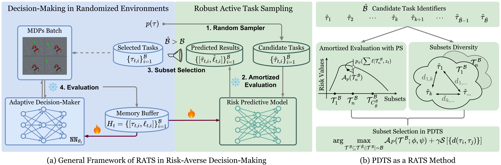
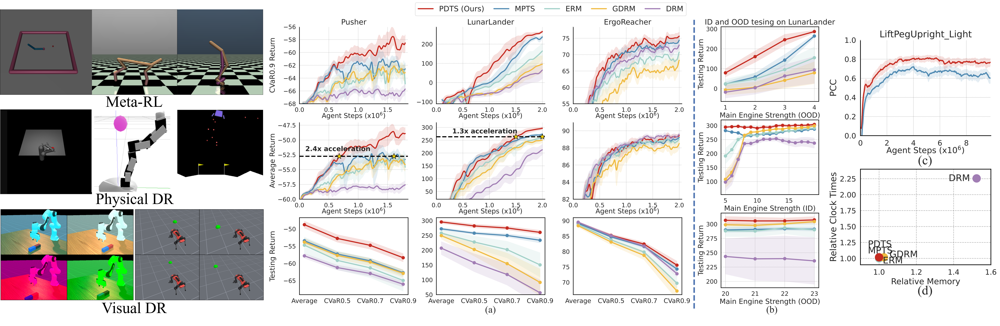

<div align="center">

# Posterior and Diversity Synergized Task Sampling (PDTS)

<div align="center">
  <a href="https://thu-rllab.github.io/PDTS_project_page/">
    
  </a>
  &nbsp;&nbsp;
  <a href="https://arxiv.org/abs/2504.19139">
    
  </a>
</div>
<br>

</div>

## Introduction

Task robust adaptation is a long-standing pursuit in sequential decision-making. Some risk-averse strategies, e.g., the conditional value-at-risk principle, are incorporated in domain randomization or meta reinforcement learning to prioritize difficult tasks in optimization, which demand costly intensive evaluations. The efficiency issue prompts the development of robust active task sampling to train adaptive policies, where risk-predictive models can surrogate policy evaluation. This work characterizes robust active task sampling as a secret Markov decision process, posits theoretical and practical insights, and constitutes robustness concepts in risk-averse scenarios. Importantly, we propose an easy-to-implement method, referred to as <b>Posterior and Diversity Synergized Task Sampling (PDTS)</b>, to accommodate fast and robust sequential decision-making. Extensive experiments show that PDTS unlocks the potential of robust active task sampling, significantly improves the zero-shot and few-shot adaptation robustness in challenging tasks, and even accelerates the learning process under certain scenarios.

<div align="center">
  
</div>
<div align="center">
  
</div>


## Code Structure

Please refer to the following folders for specific code implementations:
- [`sinusoid/`](sinusoid/) - Code for sinusoid regression experiments
- [`RL/`](RL/) - Code for reinforcement learning scenarios

## Citation

If you find this repository or paper useful for your research, please cite

```bibtex
@misc{wang2025MPTS,
    title={Model Predictive Task Sampling for Efficient and Robust Adaptation}, 
    author={Qi Cheems Wang and Zehao Xiao and Yixiu Mao and Yun Qu and Jiayi Shen and Yiqin Lv and Xiangyang Ji},
    year={2025},
    eprint={2501.11039},
    archivePrefix={arXiv},
    primaryClass={cs.LG},
    url={https://arxiv.org/abs/2501.11039}, 
}
@misc{qu2025PDTS,
    title={Fast and Robust: Task Sampling with Posterior and Diversity Synergies for Adaptive Decision-Makers in Randomized Environments}, 
    author={Yun Qu and Qi Wang and Yixiu Mao and Yiqin Lv and Xiangyang Ji},
    year={2025},
    eprint={2504.19139},
    archivePrefix={arXiv},
    primaryClass={cs.LG},
    url={https://arxiv.org/abs/2504.19139}, 
}
```